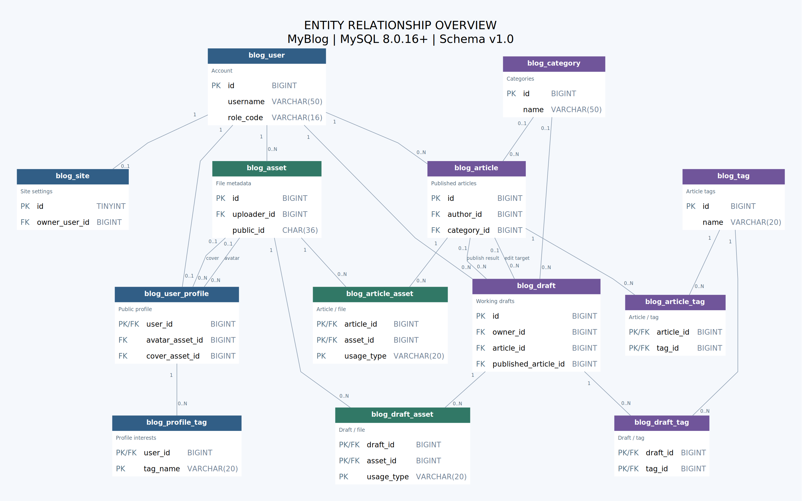

# MyBlog 数据库设计说明

版本：v1.0 · 2026-09-12  
适用：单个博客站点，当前一个作者，后端使用 Spring Boot / Spring MVC + MyBatis。  
数据库：MySQL 8.0.16 及以上或 MySQL 8.4，InnoDB，utf8mb4。  
分析基线：GitHub `muggle893/myblog` 的 `bb92a53e0041fa12ae1d1c97c9e7323107e91232`，已核对最新封面、头像、自我介绍编辑功能。

## 1. 结论与适用范围

采用 **8 张主体表 + 5 张关联表，共 13 张表**。账号、公开资料、站点设置、文章、草稿、分类、标签、文件各自保存；标签与文件的关联独立保存。

这个规模用于完整承接现有前端，而不是一次性加入评论系统、权限管理平台或消息中心。关联表通常只有三列，不代表需要开发 13 个管理页面。数据库设计不会自动实现接口、鉴权、文件上传或数据迁移，这些仍由后端实现。

可拓展性的目标是让新增功能尽量通过新表、新接口或小规模迁移完成。**不能保证未来任何需求都完全不用改表。** 当前明确是一库一个站点；若以后要做多个用户各有独立域名、独立分类的博客平台，需要引入租户/站点隔离模型，这不等同于只增加作者账号。

## 2. 已核对的前端功能

| 页面/代码 | 当前真实行为 | 数据库设计 |
|---|---|---|
| `LoginView.vue`、`state.js` | 无注册入口；任意非空凭据只是演示登录 | `blog_user` 保存唯一账号、密码哈希和状态；后端校验真实凭据 |
| `HomeView.vue` | 文章列表、分类筛选、文章/分类/标签计数、最近关注标签 | 正式文章 + 分类 + 标签；列表和统计使用相同可见性条件 |
| `ProfileView.vue` | 昵称、签名、头像、个人封面、封面上下位置、介绍标题/正文/标签 | 公开个人资料 + 个人标签 + 文件元数据 |
| `state.js`、首页、页眉/页脚 | 博客名称、首页横幅标题、副标题统一展示 | 单独的 `blog_site`，不与某位作者的自我介绍混在一起 |
| `EditorView.vue` | 标题、Markdown、单个分类、多个标签、公开/私有 | 正式文章和草稿使用相同内容字段；一篇文章最多一个分类、10个标签 |
| `drafts.js`、`DraftsView.vue` | 多篇新文章草稿；已发布文章的修改草稿；自动保存和删除 | 独立 `blog_draft`，通过可空 `article_id` 区分新稿和修改稿 |
| `ArticleView.vue`、`posts.js` | 游客只能读公开文章；作者能读自己私有文章；编辑已发布文章 | 服务端按文章作者和可见性查询，不能沿用全局 `owner=true` 就能读所有文章的演示规则 |
| `images.js`、编辑器 | 图片粘贴、拖拽、图片/任意文件附件，当前单个文件不超过20MiB | 文件实际内容在磁盘/对象存储，数据库保存元数据及引用关系 |
| Markdown 导入导出 | 导入正文、导出 `.md`，当前导入上限2MiB | 不需要单独建导入/导出表；以后要后台批处理时再加任务表 |
| 明暗主题、Toast、编辑器光标 | 浏览器交互状态 | 暂时保留浏览器，不为所有UI状态建表 |

没有把当前未实现的点赞、评论、全文检索、阅读量或验证码当成现有功能。主页“阅读N分钟”是阅读时间估算，不是文章浏览次数。“最近在关注”当前来自可见文章标签，不是关注关系。

## 3. 表清单

| 表 | 用途 | 关键关系 |
|---|---|---|
| `blog_user` | 登录账号、密码哈希、角色、启用状态、可选联系方式 | 一个账号可写多篇文章、保存多份草稿、上传多个文件 |
| `blog_user_profile` | 公开昵称、介绍、签名、头像及封面 | `user_id` 同时是主键和外键，一个账号最多一份资料 |
| `blog_profile_tag` | 个人技能/兴趣标签及顺序 | 属于个人资料，不与文章标签词典混用 |
| `blog_site` | 全站博客名、首页标题和介绍、站长 | 当前只有 `id=1` 一行 |
| `blog_category` | 可维护的分类词典 | 文章/草稿各有一个可空的分类外键 |
| `blog_tag` | 文章和草稿共用的标签词典 | 不直接在文章里存逗号分隔字符串 |
| `blog_article` | 正式文章及发布时间、可见性、版本号 | 保存线上内容，不接收自动保存 |
| `blog_article_tag` | 正式文章和标签多对多关系 | 联合主键防重复，并保存展示顺序 |
| `blog_draft` | 新稿和修改稿、保存时间、并发版本及发布结果 | 修改稿关联原文章；发布结果关联正式文章 |
| `blog_draft_tag` | 草稿标签 | 修改草稿的标签不改变线上文章标签 |
| `blog_asset` | 所有图片与附件的文件元数据 | 有上传者；位置由存储提供方、bucket和object_key表示 |
| `blog_article_asset` | 正式文章引用的文件 | 支持正文图片和下载附件 |
| `blog_draft_asset` | 草稿引用的文件 | 草稿删改不直接删除正在被正式文章使用的文件 |

完整的 **99个字段**、类型、默认值、主外键和注释见 `field-dictionary.md`，最终约束以 `01-schema.sql` 为准。

## 4. E-R 图



图中的 `1` 表示必须有一个，`0..1` 表示可选且最多一个，`0..N` 表示零到多个；PK 是主键，FK 是外键。同一对表出现两条线，代表不同字段的关系，例如个人头像与封面、修改目标与发布结果。

为了便于看清字段，另附三张分图：

- `er-01-profile.svg`：账号、公开资料、站点和图片。
- `er-02-writing.svg`：文章、草稿、分类和标签。
- `er-03-assets.svg`：文章、草稿、个人资料如何引用文件。

总图和分图提供 SVG 与 PNG；SVG 可以放大查看。`myblog-er.mmd` 是可编辑的 Mermaid 源文件，`.dot` 是图片的排版源文件。分图中重复出现的表只是上下文，并不是要创建多份表。

关键关系：

1. 用户与个人资料是一对零或一。初始化账号时，后端应在同一事务内创建资料。
2. 用户与文章、草稿、上传文件是一对多。
3. 分类与文章是一对多；没有分类时存NULL，页面显示“未分类”。
4. 文章与标签、草稿与标签分别是多对多，通过关联表实现。
5. 一篇正式文章可以有多份历史修改草稿，但同一作者同一篇文章最多一个活跃修改草稿。
6. 文件可被文章、草稿和个人资料复用；不能把“删除某篇草稿”等同于“删除它用过的所有图片”。

## 5. 关键设计决定

### 5.1 登录账号、个人资料和全站设置分开

`blog_user` 保存账号和凭据；公开接口只返回 `blog_user_profile` 中可公开的字段，不应把账号实体直接序列化给游客。

昵称存在资料表，文章只保存 `author_id`。列表和详情关联查询昵称，所以改名后能同步显示，无需逐篇更新作者姓名。站长的昵称变化也会影响首页的个人空间标语，因为标语可由昵称生成，不需要再存一份重复文本。

`blogTitle`、`heroTitle`、`heroSubtitle` 放到 `blog_site`。以后增加第二个作者时，作者只能改自己的资料，不应顺带把整个网站的标题改掉。当前“编辑资料”弹窗可以照旧提交一个请求：后端在同一事务中分别更新资料、个人标签以及ADMIN有权修改的站点设置。资料与站点各有 `row_version`，其中任一步冲突则整体回滚。

封面是个人主页封面，不是首页书桌背景。`cover_asset_id=NULL` 使用当前默认插画；`cover_position=48` 对应当前默认位置。头像为空时使用昵称首字。默认插画属于前端静态资源，初次建库不必假装它们已经上传并创建文件记录。

### 5.2 正式文章与草稿必须分开

例如：线上《Redis学习笔记》有1000字，你在编辑器删掉一半并等待自动保存。正确行为是草稿变成500字，游客仍能读到原来的1000字；点击“发布修改”后才更新正式文章。

- `blog_article`：线上快照，`status=PUBLISHED` 或 `ARCHIVED`。
- `blog_draft`：编辑中的快照，`article_id=NULL` 是新稿，否则是原文章的修改稿。
- `visibility`：PUBLIC/PRIVATE，与是否处于草稿阶段是两回事。即使草稿期望发布为PUBLIC，草稿也只能由其所有者查看。
- `base_article_version`：这份修改稿从原文章哪个版本开始编辑。
- `row_version`：这一份草稿本身被保存了多少次，用于防止多个标签页互相覆盖。

草稿允许空标题和空正文，正式发布必须有标题和正文。后端建议限制标题200字、Markdown正文UTF-8编码不超过2MiB；正文列使用MEDIUMTEXT留出数据库存储空间，不代表应用要放开无限上传。

`active_edit_article_id` 是生成列：只有ACTIVE修改稿才等于原文章ID，其他情况为NULL。唯一索引 `(owner_id, active_edit_article_id)` 保证一篇文章不会被创建两个活跃修改稿，同时利用可空唯一键允许一个用户有多篇不同的新文章草稿。不能在MyBatis INSERT/UPDATE中给这个生成列赋值。

复合外键 `(article_id, owner_id)` 引用文章的 `(id, author_id)`，让数据库也能拒绝“甲用户的草稿关联乙用户文章”。这个约束并不能代替API的身份校验。

### 5.3 发布要有事务、冲突检查和防重复处理

建议发布流程（Service层事务，不是把下列文字直接当SQL执行）：

1. 前端先完成最后一次草稿保存，等待未完成的自动保存和文件上传；带上草稿ID与最新草稿版本请求发布。
2. 服务端校验登录账号启用且具有写作角色。以 `id + owner_id` 锁定草稿行 `SELECT ... FOR UPDATE`，未拥有的草稿不可继续。
3. 如果草稿已是PUBLISHED，返回已有 `published_article_id`，避免用户双击或网络重试生成第二篇文章。DISCARDED拒绝发布。
4. 对ACTIVE草稿，检查客户端草稿版本等于当前 `row_version`，否则返回409冲突。校验标题、正文、分类、标签数量和文件引用。
5. 若是新稿，插入正式文章；若是修改稿，锁定原文章并检查作者、未删除、当前版本等于 `base_article_version`，再更新内容并把正式文章版本加1。
6. 在同一事务中同步正式文章标签和文件关系。任何文件必须存在、READY且允许当前作者引用；正文真实引用与关联表应保持一致。
7. 把草稿设为PUBLISHED，并填入发布结果ID、递增草稿版本号。提交事务后再处理缓存失效或异步任务。

如果正式文章已经被另一处修改，不能自动覆盖或偷偷更新 `base_article_version`，应让用户比较冲突后重新编辑。`SELECT ... FOR UPDATE` 要在事务内使用；锁与事务规则见 [MySQL锁定读取文档](https://dev.mysql.com/doc/refman/8.4/en/innodb-locking-reads.html)。

草稿箱只查询ACTIVE。点击删除建议把状态改成DISCARDED，前端继续表现为“已删除且无恢复入口”；服务端保留30天再物理清理，以便排错。PUBLISHED记录同样保留30天用于幂等重试，过期清理后旧草稿ID返回404，不应重新发布。30天是本方案建议的保留策略，需由定时任务实现，并非数据库自动执行。

### 5.4 自动保存使用乐观锁

以下是MyBatis语句示意；实际保存正文、标签和文件关系要放在同一事务中：

```sql
UPDATE blog_draft
SET title = #{title},
    content_markdown = #{contentMarkdown},
    word_count = #{wordCount},
    row_version = row_version + 1,
    saved_at = UTC_TIMESTAMP(3)
WHERE id = #{draftId}
  AND owner_id = #{currentUserId}
  AND status = 'ACTIVE'
  AND row_version = #{expectedVersion};
```

影响行数为0时，区分没有权限、不存在或版本冲突，不要直接提示“保存成功”。前端应串行发送自动保存请求，收到新版本号后再发下一次保存；页面关闭前的请求不能当作绝对可靠的保存方式。

### 5.5 标签和分类不存成一串文字

正式文章只存分类ID。标签放词典，再通过关联表关联，便于修改标签名称、按标签筛选文章和建立统计。

后端使用Unicode规范化及去首尾空白，对文章标签按大小写不敏感去重，与当前编辑器行为一致。数据库默认 `utf8mb4_0900_ai_ci` 同时不区分大小写与重音；这是一项明确的词典去重策略。如果以后需要区分重音，应通过迁移更换对应字段排序规则。

每篇文章/草稿最多10个标签、每个20字；个人资料最多12个标签、每个20字。跨行计数限制由Service在事务内执行，普通CHECK无法检查一个用户在另一张表中有几条记录。个人兴趣标签独立于文章标签，改自己的“SSM”兴趣标签不会改变文章标签统计。

当前分类选择项写在前端，后端接入时改成分类接口；禁用分类只是不让新稿选择，不让已有文章凭空消失。分类和标签被引用时数据库拒绝物理删除；应先迁移引用，再删除词典行。

### 5.6 文件内容与数据库分离，权限根据用途判断

`blog_asset` 保存原名、MIME、大小、上传者、UUID、存储位置及状态。文件字节存在磁盘或OSS，不存到文章表，也不把Base64大串塞进数据库。

建议上传接口返回稳定地址 `/api/assets/{publicId}/content` 与文件ID。Markdown使用该稳定地址；后端通过文件记录定位实际磁盘/对象存储文件。临时OSS签名URL只用于本次读取，不写进正文。未来迁移服务器或OSS只需修改存储映射/适配器，不需要替换每篇文章中的服务器IP。

正文中的 `blog-image:...`、`blog-file:...` 是当前浏览器演示专用引用，接入上传接口后要转换。使用Markdown解析器提取本站文件引用，验证资源所有权、类型与状态，再同步关系表；不能相信前端自报一个附件ID就允许绑定。允许外部普通图片URL时，它们不进入本站文件引用表，不能据此声称能控制外站文件的访问。

文件读取规则：

- READY文件的上传者，在登录有效时可读取本人文件。
- 被公开个人资料用作头像/封面的READY图片，可以公开读取。
- 被任一未删除且PUBLISHED、PUBLIC的正式文章引用的READY文件，可以公开读取。
- 私有文章文件仅向该文章作者开放；草稿文件只向草稿所有者开放。
- 其他情况拒绝读取。一个文件如果同时用于公开与私有文章，它已经因公开用途可见；要分开保密，应上传独立文件，不能仅靠换一个引用就把已公开的内容收回。

不能把含私有文件的上传目录直接作为Nginx公开静态目录。例如可以放在网站根目录以外的 `/srv/myblog/uploads`，让后端鉴权后读取，或采用Nginx internal位置配合后端授权。初期文件接口使用 `Cache-Control: private, no-store`，避免文章从公开改为私有后仍通过共享缓存提供旧文件。未来启用CDN时再设计缓存失效与授权下载。

解绑头像、替换封面、删草稿都只移除引用，不立即删除文件。后台清理无引用、超过24小时的临时文件。所有绑定操作都先按文件ID升序锁定文件行并验证READY；清理任务在READ COMMITTED事务中锁定候选文件后，重新检查头像、封面、文章和草稿引用，确认无人使用再置为DELETING并提交。磁盘/OSS删除成功后置为DELETED；失败重试。所有绑定路径必须遵守同一规则，避免清理与保存并发误删。

### 5.7 统计、排序和索引

首页列表按 `published_at DESC, id DESC` 排序，避免相同时间的文章分页不稳定。创建时间、首次发布时间、最后修改时间各有含义；编辑旧文章默认不重置首次发布时间。

主页文章数、分类数、标签数都从“当前用户可见的正式文章”计算。游客只能计入公开文章；作者可以计入公开文章与自己的私有文章，不能直接COUNT整个标签词典或草稿表。不要把私有标签通过建议接口泄露给游客；写作标签建议只开放给有写作权限的账号。

`word_count`、`reading_minutes` 和摘要是可重算的派生字段，发布时由后端生成。文章数量等聚合初期直接SQL查询，暂不维护容易不同步的计数字段。HTML渲染结果也暂不持久化，Markdown原文是内容来源；渲染时继续进行HTML净化。

SQL已包含公开列表、分类列表、作者列表、草稿列表、标签反查和附件反查索引。按实际查询使用EXPLAIN优化，不给每个字段都加索引。前端现在一次加载所有文章，后端接口可以先提供每页10篇、最大50篇的分页，前端逐步接入；中文全文检索以后单独设计，当前没有强加一个普通全文索引来冒充中文搜索。

## 6. 前端字段到后端字段的映射

| 前端字段 | 数据库 | 返回/写入说明 |
|---|---|---|
| `nickname` | `blog_user_profile.nickname` | 文章作者通过author_id关联；不在文章表重复保存昵称 |
| `signature` | `blog_user_profile.signature` | 可以为空字符串 |
| `aboutTitle` / `aboutBody` | `about_title` / `about_body` | 正文是纯文本，保留换行 |
| `aboutTags` | `blog_profile_tag` | 按sort_order组成字符串数组 |
| `avatarImageId` / `coverImageId` | `avatar_asset_id` / `cover_asset_id` | 前端需要改用服务端资源ID及返回URL，不能继续调用IndexedDB读取 |
| `coverPosition` | `cover_position` | 整数0~100 |
| `blogTitle` | `blog_site.blog_title` | 全站设置，ADMIN可写 |
| `heroTitle` / `heroSubtitle` | `blog_site.hero_title` / `hero_subtitle` | 与个人主页封面不是同一个功能 |
| `post.id` / `draft.id` | 文章/草稿BIGINT主键 | API统一转字符串，兼容Vue路由并避免JS大整数精度问题 |
| `body` | `content_markdown` | DTO可继续返回body，避免前端大改 |
| `category` | `category_id` + 分类name | 读取可返回名称，写入使用ID，不能把名称当永久标识 |
| `tags` | 标签关联表 | 读取按sort_order组装；写入在事务内校验并同步 |
| `visibility` | `visibility` | 前端小写public/private与数据库PUBLIC/PRIVATE显式转换 |
| `date` | `published_at` | 后端返回ISO时间，展示层按站点时区格式化日期 |
| `read` | `reading_minutes` | 展示时拼成“N 分钟”，不保存带单位字符串 |
| `excerpt` | `summary` | 保留当前约110字的提取习惯，数据库容量500字 |
| `updatedAt` | `updated_at` | ISO时间并明确时区 |
| 草稿`kind` | 从`article_id IS NULL`推导 | 不额外存一列可能与article_id矛盾的kind |
| 草稿`postId` | `blog_draft.article_id` | 为NULL时是新文章草稿 |
| 草稿`createdAt` / `savedAt` | `created_at` / `saved_at` | 草稿箱按saved_at排序 |
| `owner`演示布尔值 | 不直接映射到表 | 登录会话返回当前userId和能力；作者校验必须逐资源执行 |
| `theme`、revision计数器 | 不需要数据库列 | 浏览器状态/响应式刷新标记 |

数据库可见性默认PRIVATE是防止后端遗漏字段时意外公开；现有前端默认选PUBLIC可以保留，但每次保存和发布要显式传入选择，后端不能忽略它。

文章详情里现有 `post.id.startsWith('local-')` 判断“我的/示例文章”应移除或改成API提供的来源标记。接入数据库后停止自动拼接 `samplePosts`，否则空数据库也会继续显示演示文章。昵称和主题等固定文案之外，首页侧栏介绍、页脚口号目前仍是前端常量，本方案没有声称它们已经可编辑；以后需要时可在资料表或站点表加明确字段。

## 7. 登录与权限的边界

账号只在数据库或受控初始化流程创建，不开放注册接口。初始化文件默认创建禁用账号，设置密码哈希并启用后才能真正登录。密码使用Spring Security的PasswordEncoder做单向校验，不能存明文，也不要改成简单MD5/SHA256。

后端生成哈希的示意：

```java
PasswordEncoder encoder = PasswordEncoderFactories.createDelegatingPasswordEncoder();
String hash = encoder.encode(password); // password来自受控输入，不写在仓库里
boolean valid = encoder.matches(inputPassword, hash);
```

DelegatingPasswordEncoder可以在哈希中保存算法标识，便于日后升级算法；具体说明见 [Spring Security密码存储文档](https://docs.spring.io/spring-security/reference/features/authentication/password-storage.html)。数据库CHECK只能验证启用账号的哈希不为空，不能判断字符串是不是有效的哈希，后端必须保证。

ADMIN负责站点设置与分类管理；AUTHOR可管理自己的文章和资料；READER不具备写作能力。即使未来增加第二个作者，也不默认让ADMIN读取其他作者的私有文章。若以后需要明确的审核/管理员内容访问，应作为独立权限设计并记录操作，而不是直接绕过“仅本人可见”的约定。

邮箱和手机号为可选唯一字段，不填写存NULL。验证码登录正式接入时，需要先完成联系方式验证与绑定；当前预留字段不表示验证码能力已经实现。邮箱规范化策略要一致，手机号统一国家码格式。

## 8. 可扩展方向

| 后续功能 | 扩展方式 | 现有结构怎样支持 |
|---|---|---|
| 评论与回复 | 新增blog_comment，关联article_id、user_id、parent_id和审核状态 | 文章与作者使用稳定主键；评论接口仍先验证文章可读 |
| 点赞/收藏 | 新增article_like、article_bookmark；唯一键(user_id, article_id) | 无需把逗号ID字符串塞进文章表 |
| 阅读量 | 新增article_stats或访问事件表，Redis聚合后落库 | 与文章正文分开更新，减少写热点 |
| 多作者 | 创建多个账号，按author_id/owner_id校验 | 已避免所有文章默认属于固定Frank；站点仍是一个 |
| 更细的角色权限 | 新增role、permission、user_role、role_permission并迁移role_code | 当前简单角色足够；未来多角色会需要一次迁移 |
| 邮箱/短信验证码 | Redis保存验证码校验材料、TTL、频率与失败次数；可另加登录审计表 | user.email/phone用于绑定身份，不长期保存明文验证码 |
| Redis缓存 | 缓存公开文章详情、列表和站点资料；更新事务提交后失效 | MySQL保持事实来源；私有响应不混进公共缓存key |
| RabbitMQ | 文章发布事件驱动通知、索引和缩略图；需要可靠投递时新增outbox_event | 正式文章id和row_version可作为事件定位与幂等依据 |
| RabbitMQ可靠消费 | 新增消费去重记录，或用业务唯一键防重复 | 消息可能重复；消费者成功处理并提交后再确认 |
| 历史版本/恢复 | 新增article_revision，保存正式发布快照及操作者 | 草稿不是完整版本历史；row_version只检测冲突，不保存旧正文 |
| 阿里云OSS/S3 | 实现存储适配器，迁移文件并更新storage_provider、bucket、object_key | Markdown保留稳定API资源地址，不存临时签名链接 |
| 分类层级 | 给category增加parent_id与外键，校验无环 | 现在无需提前实现树状分类 |
| 一篇文章多个分类 | 新增article_category，迁移原category_id | 与现有“一篇一个分类”是需求变化，需要受控迁移 |
| 多个独立站点 | 引入site_id隔离、站点内唯一键、账号成员关系 | 当前单例blog_site不等于已支持多租户，届时要明确重构范围 |

不创建一个无约束的“万能扩展JSON”代替所有列。需要查询、唯一性和关联的数据使用明确字段与关系；真正稀疏的插件设置未来可以放在专门的JSON配置中。也不提前创建一整套尚无需求的微服务数据库。

## 9. 运行、迁移与实现顺序

先执行 `SELECT VERSION();` 确认版本。使用8.0.16为最低版本是因为本方案依赖CHECK真正执行；旧MySQL版本可能只解析但不执行这些约束。[MySQL CHECK文档](https://dev.mysql.com/doc/refman/8.0/en/create-table-check-constraints.html)

1. 在新的开发数据库运行 `01-schema.sql`，创建数据库与13张表。不要在现有生产库上反复运行初始化脚本。
2. 按需运行 `02-initial-data.sql` 创建唯一账号、资料、站点和三个分类；默认账号禁用。准备好有效密码哈希后再启用。
3. 运行 `03-query-examples.sql` 理解公开列表、详情、分类统计、草稿和站点资料查询。这份示例只有读操作。
4. 首先实现登录、公开资料、站点资料与分类接口，再接文章列表/详情，之后实现文件上传、草稿保存和发布事务。
5. 前端 `services/state.js`、`posts.js`、`drafts.js` 改为调用接口；图片逻辑改为上传文件并使用服务端URL；保留前端Markdown净化。
6. 将浏览器里已有文章、草稿、个人资料、IndexedDB文件作为一次专门迁移。部署新前端或运行建表SQL不会自动把这些本地数据导入MySQL。

浏览器迁移顺序：导出原数据和所有图片/附件 → 创建用户与资料 → 上传文件建立旧ID到新ID映射 → 建立分类标签映射 → 替换Markdown中的本地资源引用 → 导入文章和草稿 → 校验数量、可见性和图片。不同浏览器各有独立数据，应先选定迁移来源，不要把多份本地数据无条件重复导入。

时间字段统一存UTC，数据库连接会话也设置UTC，后端序列化ISO时间时明确偏移；前端展示可使用Asia/Shanghai。不依赖服务器系统时区隐式决定文章日期。

后端命名推荐数据库snake_case、Java camelCase，开启MyBatis驼峰映射；BIGINT映射Long，DATETIME可映射LocalDateTime但必须遵守UTC约定，或者在类型处理器中显式转换Instant。API中的所有ID用字符串。带AUTO_INCREMENT和生成列的字段不要由前端直接赋值。

项目逐渐稳定后，把DDL作为版本迁移管理，例如先保留本文件为 `V1__init.sql`，再把新功能写入 `V2__add_comments.sql`。不要只改V1再期望老数据库自动同步，也不要用删库重建处理正式数据。外键、唯一键和CHECK提供数据库层约束；事务与应用校验补足跨表业务规则。[MySQL外键文档](https://dev.mysql.com/doc/refman/8.4/en/create-table-foreign-keys.html)

服务器备份必须覆盖MySQL和文件存储两部分；只有代码仓库或dist压缩包不能恢复文章、头像和附件。不要把实际数据库凭据、用户密码哈希、私人内容备份或上传文件提交到公开GitHub仓库。

## 10. 文件与验证说明

- `01-schema.sql`：建库建表语句，字段均有中文注释。
- `02-initial-data.sql`：可选的首次初始化数据，不含通用可登录密码。
- `03-query-examples.sql`：6组只读查询示例。
- `field-dictionary.md`：与DDL同源生成的字段字典。
- `myblog-er.svg` / `.png` / `.mmd`：完整E-R图与可编辑源。
- `er-01-profile.*`、`er-02-writing.*`、`er-03-assets.*`：3张分图。
- `schema-metadata.json`：从DDL提取的机器可读表、字段与外键信息。
- `validation.md`：本次实际执行的验证范围与结果。

设计分析与所有图均由本项目代码和交付SQL生成，不是套用通用博客模板。尚未修改你的后端、现有服务器数据库或线上数据。
